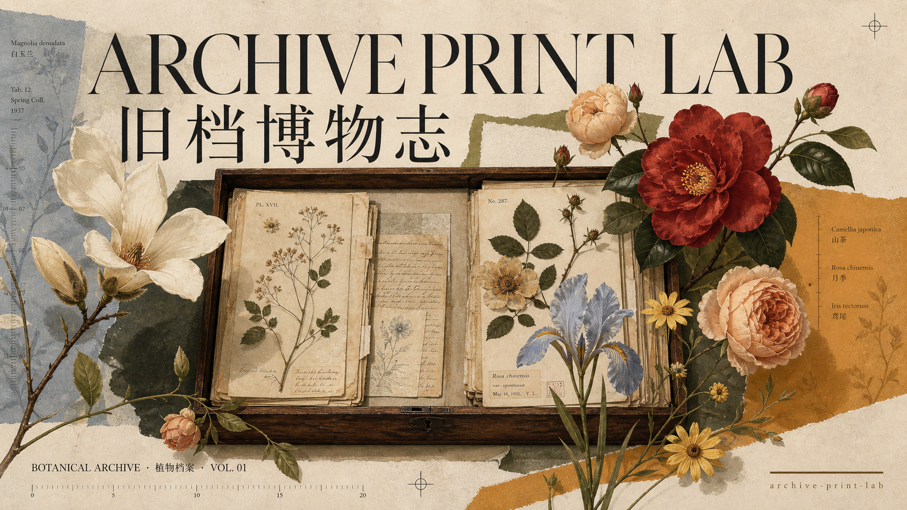
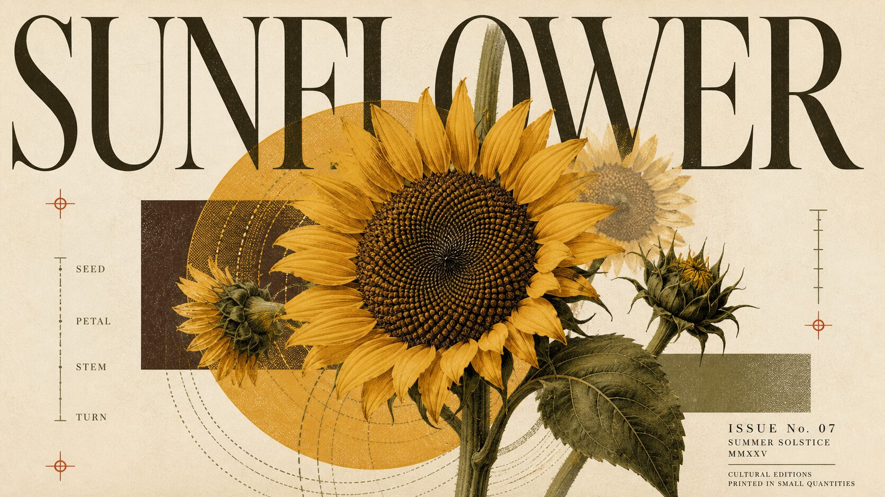
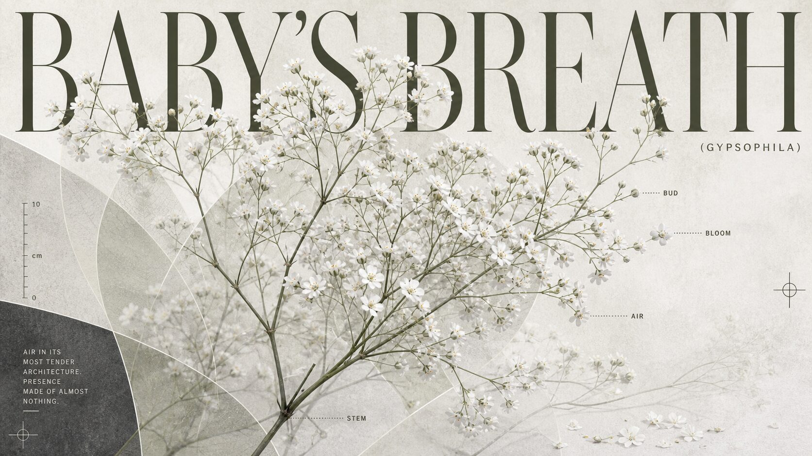
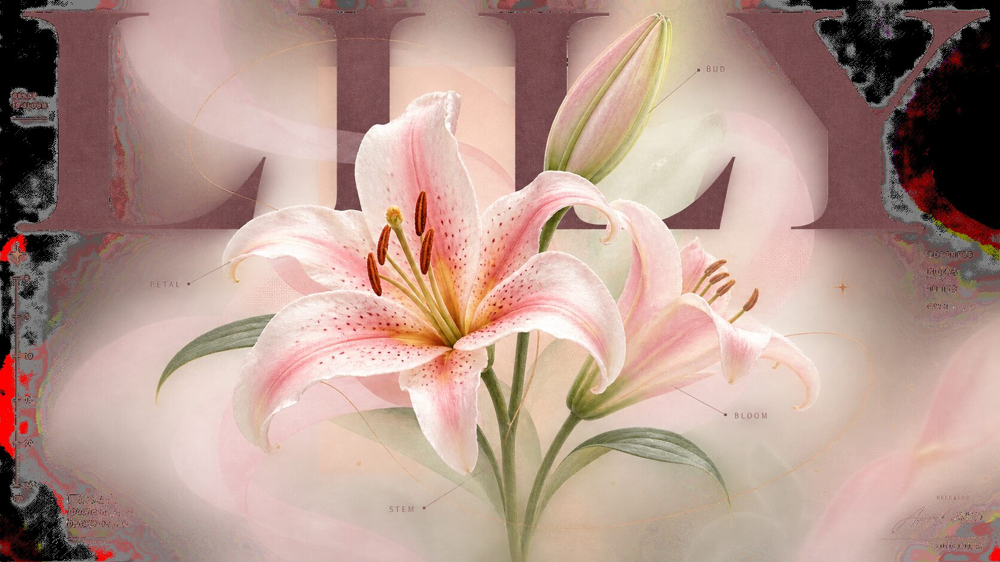
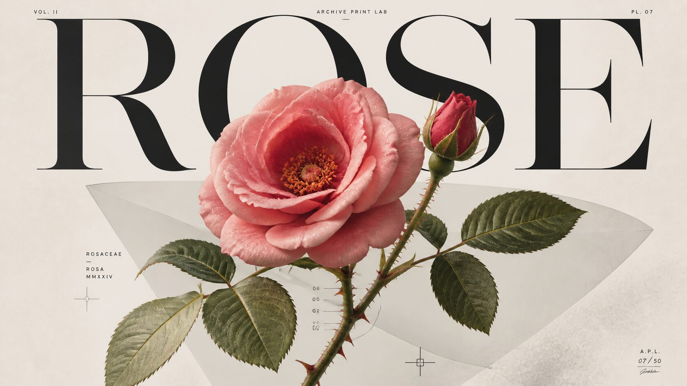
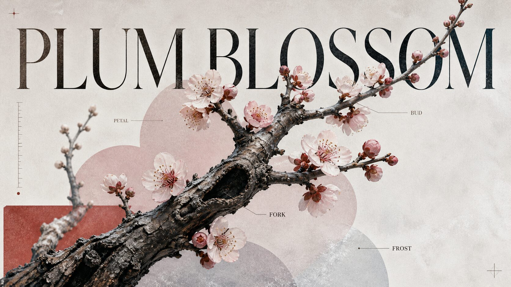
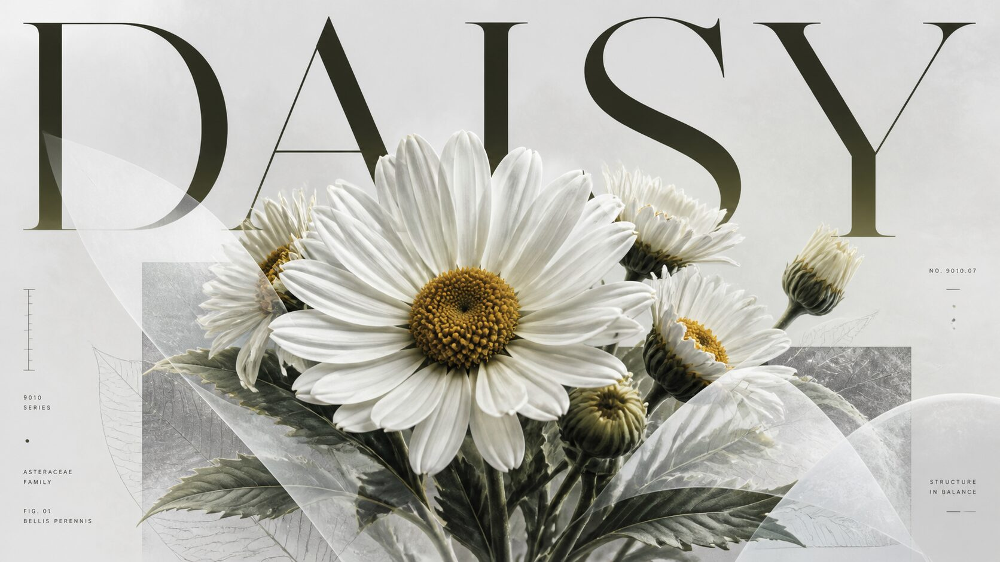
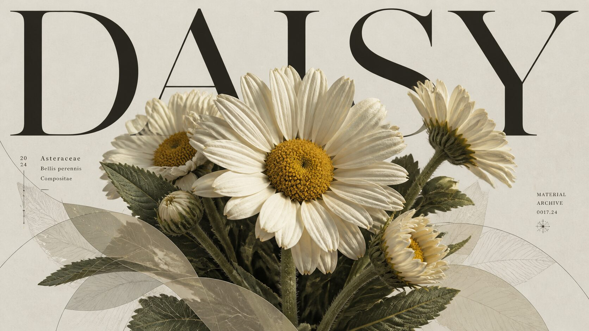
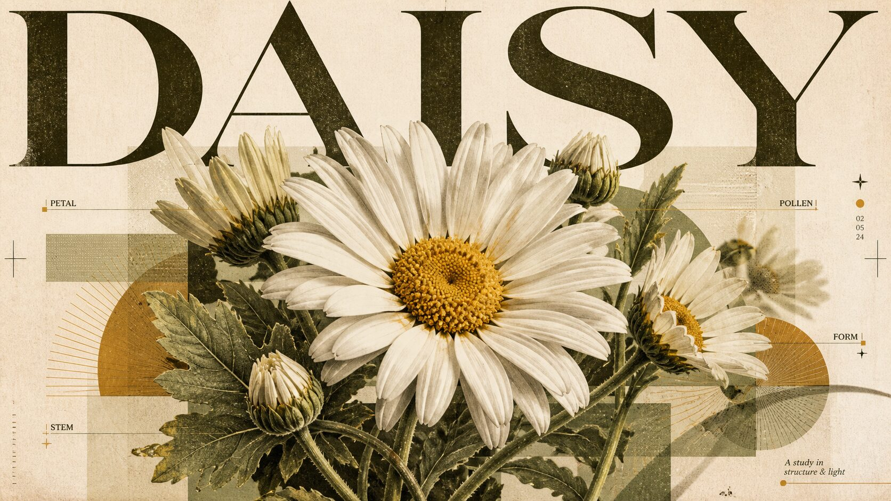
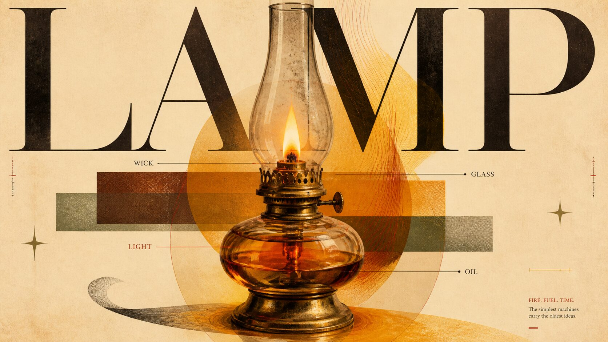

<p align="center">
  
</p>

<h1 align="center">Archive Print Lab / 旧档博物志</h1>

<p align="center">
  <strong>Turn a subject into an editorial printed page: title, specimen, paper, and a place to breathe.</strong><br />
  <em>A visual system for turning a subject into an authored editorial cover.</em>
</p>

<p align="center">
  <a href="releases/archive-print-lab-v5.1.0-generator-agnostic.tar.gz">Download v5.1.0</a>
  · <a href="SKILL.md">Read the Skill</a>
  · <a href="README.md">中文</a>
</p>

<p align="center">
  <a href="releases/archive-print-lab-v5.1.0-generator-agnostic.tar.gz"></a>
  <a href="LICENSE"></a>
</p>

---

## A picture should feel like a page someone took the time to edit

This is not about placing a flower, tree, or object on a pleasant background.

Archive Print Lab makes the **oversized title, complete subject, printed carrier, material detail, and controlled silence** touch one another on the same page. The title is not merely a caption. The subject is not merely an illustration. Blank space is not unfinished space.

With a new theme, the specimen, palette, material evidence, and paper mood are rewritten. The page relationship remains.

> A successful image feels like a page lifted from an unpublished field volume: it has a point of view, material presence, order, and a little room left unsaid.

## From one word to a printed page

| You bring | Archive Print Lab compiles | You receive |
|---|---|---|
| A sunflower, an oil lamp, a rose, a material, or a proposition | Subject form · title scale · contact field · fresh palette · surface finish · release | A generator-ready visual direction, plus a clear composition and palette rationale |

For example, `oil lamp` does not become a lamp sitting on a table. It becomes a central event made of brass, amber oil, glass, flame, and evidence of use; only then do the title, printed planes, and quiet colophon find their proper places.

## Start in 30 seconds

1. Download the [v5.1.0 Skill package](releases/archive-print-lab-v5.1.0-generator-agnostic.tar.gz), or clone this repository.
2. Put the complete `archive-print-lab/` folder in your Skill environment, or let your agent read [`SKILL.md`](SKILL.md).
3. Name a subject:

```text
/archive-print-lab generate a sunflower with Image2
/archive-print-lab write a poster prompt for an oil lamp
/archive-print-lab make a material archive for a rose
```

Unless you specify a mood, the surface is resolved from the theme’s material, light, sense of time, and viewing purpose. An explicit visual direction always takes priority.

## The fixed page grammar

```text
oversized title
      ↕
printed contact field ←→ complete, compact central subject
      ↕
material volume · sparse indexing · quiet lower-right release
```

| Page role | What it does |
|---|---|
| **Oversized title** | The first reading event: authoritative, but never pressed against the edge. |
| **Complete subject** | A flower stays a flower; an object stays an object. Establish the whole before the detail. |
| **Contact field** | Translucent planes, paper edges, contours, or printed traces pass through the subject to create front/back tension. |
| **Soft / hard split** | Petals, glass, bark, and metal retain volume; type, rules, and ticks retain printed precision. |
| **Theme palette** | Each theme earns a fresh palette rather than inheriting the mood of the previous image. |
| **Editorial release** | A quiet lower or lateral continuation carries a small `archive-print-lab` imprint—not extra decoration. |

## The subject chooses the finish, not a template

The page grammar is stable; the paper atmosphere changes with the theme. It is usually resolved internally and can be overridden by a clear request.

| Finish | Character | Often suits |
|---|---|---|
| `contemporary_frosted` | High-key mineral field, selective matte diffusion, cool light | White flowers, minerals, clear cold air |
| `warm_analog_print` | Warm paper, restrained overprint and halftone behavior | Brass, amber, summer botanicals |
| `crisp_modern_graphic` | Bright, clean, sharper boundaries | Instruments, geometry, precise lines |
| `material_archive` | Material evidence leads: velvet, fibers, wax, wear | Botany, textiles, craft, object surfaces |
| `custom` | Makes room for an explicit requested atmosphere | A specific era, emotion, or medium |

## Selected works

### Theme studies

<table>
  <tr>
    <td width="33.33%" align="center" valign="top">
      <a href="examples/babys-breath.png"></a><br />
      <strong>Baby’s Breath</strong><br /><sub>White blossoms, an airy branch network, mineral cool light.</sub>
    </td>
    <td width="33.33%" align="center" valign="top">
      <a href="examples/lily-pink.png"></a><br />
      <strong>Pink Lily</strong><br /><sub>Cup-shaped bloom, translucent edges, soft gray field layers.</sub>
    </td>
    <td width="33.33%" align="center" valign="top">
      <a href="examples/lily-pink-warm.png"></a><br />
      <strong>Pink Lily · Warm</strong><br /><sub>A warm-print variant of the same subject.</sub>
    </td>
  </tr>
  <tr>
    <td width="33.33%" align="center" valign="top">
      <a href="examples/rose.png"></a><br />
      <strong>Rose</strong><br /><sub>Velvet petals, thorns, and botanical proximity.</sub>
    </td>
    <td width="33.33%" align="center" valign="top">
      <a href="examples/plum-blossom.png"></a><br />
      <strong>Plum Blossom</strong><br /><sub>Buds, forks, and almost frost-colored air.</sub>
    </td>
    <td width="33.33%" align="center" valign="top">
      <a href="examples/daisy.png"></a><br />
      <strong>Daisy</strong><br /><sub>Baseline: bright daisies with a mineral field layer.</sub>
    </td>
  </tr>
</table>

### Daisy — finish variants (same subject, different mood)

<table>
  <tr>
    <td width="33.33%" align="center" valign="top">
      <a href="examples/daisy-v2.png"></a><br />
      <strong>Daisy · Variant 1</strong><br /><sub>Different surface finish on the same theme.</sub>
    </td>
    <td width="33.33%" align="center" valign="top">
      <a href="examples/daisy-v3.png"></a><br />
      <strong>Daisy · Variant 2</strong><br /><sub>Another palette and field relationship.</sub>
    </td>
    <td width="33.33%" align="center" valign="top">
      <a href="examples/daisy-v4.png"></a><br />
      <strong>Daisy · Variant 3</strong><br /><sub>Shows the range of a fixed page grammar with a variable finish.</sub>
    </td>
  </tr>
</table>

> These are generated studies, not templates to copy. The last row is the same daisy subject rendered in three different finishes, demonstrating how the page grammar stays fixed while the mood shifts.

## Where it fits—and where it does not

| Good fit | Not the right tool |
|---|---|
| Plants, artifacts, materials, craft, and single-subject themes | Dense data graphics and dashboards |
| Content that can compress into one central visual event | Multi-character, multi-location narrative scenes |
| Series covers, feature posters, exhibition, and publishing key art | E-commerce white-background assets and ordinary product pages |
| Projects that need one page language without making every image identical | Finished layouts requiring a model to typeset long text perfectly |

## About text in generated images

Image-native lettering is approximate. Archive Print Lab keeps display titles short and hierarchic, but does not promise pixel-perfect spelling or typesetting. Its priority is page relationship, material presence, and reading order.

The generation tool is an execution medium, not the center of this visual method. Keep titles short, set the intended ratio, and adapt the final parameters to your chosen tool.

<details>
<summary><strong>Package structure and validation</strong></summary>

```text
archive-print-lab/
├── SKILL.md                 # visual contract and workflow entrypoint
├── manifest.json            # package metadata
├── references/              # theme, composition, finish, and review cards
├── schemas/                 # structured records
├── scripts/validate_skill.py
├── workflows/               # operational checklists
└── releases/                # packaged archive and checksums
```

```sh
python3 scripts/validate_skill.py
```

</details>

## License

Released under the [MIT License](LICENSE). You may use, modify, and distribute the project; retain the copyright and license notices. No warranty is provided.

---

<p align="center">
  <em>旧档博物志 · Archive Print Lab</em><br />
  Compiled with care. Pressed with intent.
</p>
