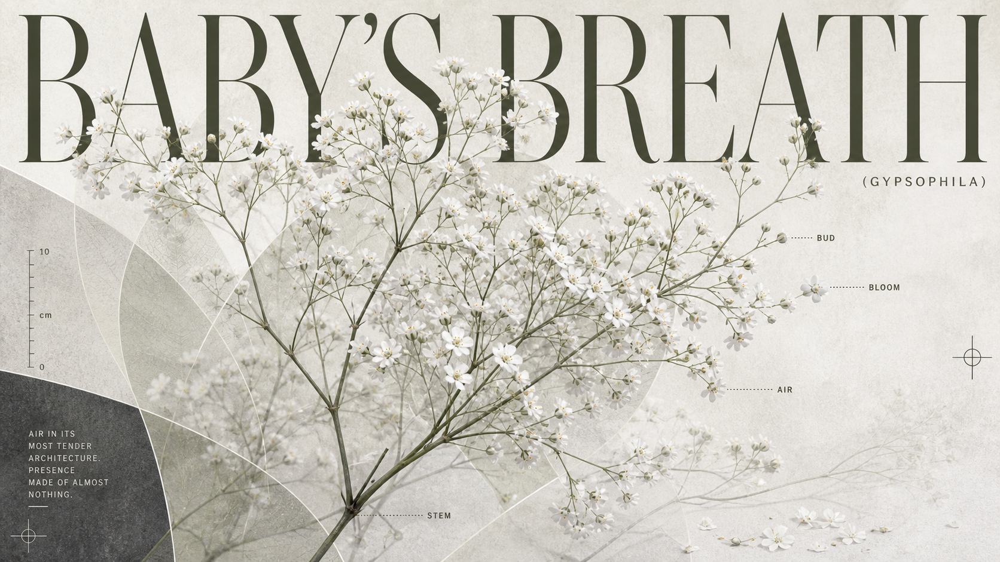
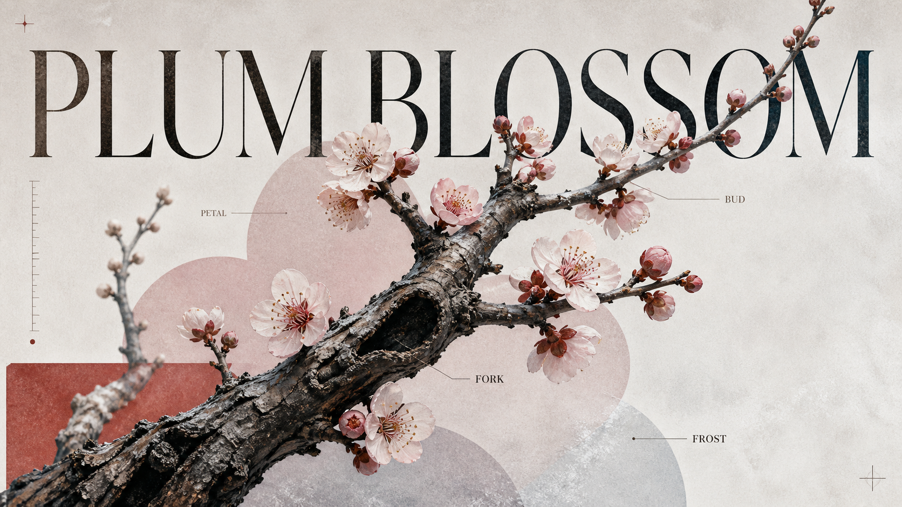

# Archive Print Lab / 旧档博物志

<p align="center">
  
  
  
  
  
  
</p>

<p align="center">
  <strong>把任何一个主题，编译成一张精工细作的编辑海报。</strong><br>
  <em>An editorial image-generation prompt compiler — one fixed visual family, any subject.</em>
</p>

---

## 这不是一个风格，是一套印刷语法

> 你丢进去一个词：向日葵、油灯、钢笔、玫瑰。
> 它吐出来的不是"一张图"，而是一份完整印刷物的**结构图纸**——标题在哪、标本有多大、色板怎么配、留白怎么收。
>
> 换主题只换**标本**，骨架永远是同一套。

```text
┌──────────────────────────────────────────┐
│                                          │
│   SUNFLOWER     ← 巨型衬线标题（1/3–1/2 画面）
│   SUNFLOWER                              │
│                                          │
│        ░░░░ 半透明印刷载体场 ░░░░         │
│       ╭─────────────╮                    │
│       │   完整标本   │  ← 紧凑居中主体     │
│       │  不被拆解    │   不被压扁          │
│       ╰─────────────╯                    │
│        ░░░░ 接触穿过 · 遮挡 ░░░░         │
│                                          │
│  ·──·──·──·   ← 刻度 / 标注 / 十字标记   │
│                                          │
│                                            archive-print-lab → 落款
│                                      ─────
└──────────────────────────────────────────┘
```

**每张海报都遵守同一套九宫格压力系统：**

| # | 结构层 | 做什么 |
|---|--------|--------|
| 1 | **巨型标题** | 衬线大标题压住上方 1/3–1/2，保留 3–5% 顶部呼吸，侧边窄边距 |
| 2 | **中央标本** | 完整、紧凑、不被拆解成零散零件 |
| 3 | **接触场** | 半透明印刷载体穿过标本，前后遮挡、对齐、延伸 |
| 4 | **软 / 硬分离** | 花瓣的体积感 ≠ 印刷线条的锐利感 |
| 5 | **主题色板** | 每次从零独立编译，禁止继承历史主题颜色 |
| 6 | **右下落款** | 安静的留白释放区 + 小字 `archive-print-lab` 出版署名 |

## 五种完成面，由主题决定

换主题时，骨架不变；**印刷表面的气质由主题自己决定**：

| 完成面 | 气质 | 适合 |
|--------|------|------|
| `contemporary_frosted` | 当代冷灰弥散 | 白花、矿物、清冷光线 |
| `warm_analog_print` | 暖调模拟印刷 | 黄铜、琥珀、夏日植物 |
| `crisp_modern_graphic` | 清晰现代图形 | 器械、几何、锐利线条 |
| `material_archive` | 材质档案 | 绒面、皮革、植物学精度 |
| `custom` | 用户指定 | 任何明确请求的特殊氛围 |

不需要每次问 A/B/C——系统自己判断，你说"随你"时直接出图。

## 后端无关：写什么模型都是同一套

这套 Skill **不依赖任何具体生图模型**。它编译的是**结构化的视觉指令**，不是某个 API 的语法糖。

默认交付一条即用提示词。当你指定生成器时，只做语法适配，视觉逻辑不变：

```text
支持后端
├── gpt-image-2 / Image2
├── Midjourney
├── Flux / SDXL / Stable Diffusion / ComfyUI
├── DALL·E
├── Gemini
├── 即梦 · 通义万相 · 豆包
└── 任何其他生图工具
```

> 没有生图模型也能用：主题规划、构图推演、色板编译、结果审查，全部只靠文字完成。

## 画廊 · 生成效果

<div align="center">

**向日葵** &nbsp;|&nbsp; **满天星** &nbsp;|&nbsp; **百合（粉）**

 |  | 

**油灯** &nbsp;|&nbsp; **树** &nbsp;|&nbsp; **雏菊**

 |  | 

**玫瑰** &nbsp;|&nbsp; **梅花** &nbsp;|&nbsp; **百合（星花）**

 |  | 

</div>

<details>
<summary>📋 各主题使用的完成面</summary>

| 主题 | 完成面 | 要点 |
|------|--------|------|
| 向日葵 | 暖调模拟印刷 | 金黄花瓣 · 深色种盘 · 夏至光线 |
| 满天星 | 当代冷灰弥散 | 白色小花 · 矿物冷光 · 轻盈枝条 |
| 百合（粉） | 柔和粉彩编辑 | 粉色花瓣 · 斑点花喉 · 温柔渐变 |
| 油灯 | 暖调模拟印刷 | 黄铜底座 · 琥珀燃油 · 燃烧灯芯 |
| 树 | 泥土模拟 | 扭曲树干 · 苔藓树冠 · 年轮分叉 |
| 雏菊 | 当代冷灰弥散 | 白色花瓣 · 金色花心 · 结构平衡 |
| 玫瑰 | 材质档案 | 绒面花瓣 · 带刺茎干 · 植物学精确 |
| 梅花 | 精致编辑 | 淡粉花瓣 · 霜色背景 · 分叉花苞 |
| 百合（星花） | 梦幻弥散 | 暖粉色调 · 光感氛围 |

</details>

> *画廊中的图片为各主题的代表性生成示例。实际效果因所选生成器和参数而异。*

## 怎么用

```text
# 在支持 /archive-print-lab 的环境中：

/archive-print-lab 用 image2 生成一张向日葵
/archive-print-lab 为油灯写一张海报提示词
/archive-print-lab 制作一份关于玫瑰的材质档案
```

核心入口：[`SKILL.md`](SKILL.md) — 路由任务、编译主题与色板、规划构图，产出可直接使用的提示词。

## 项目结构

```text
archive-print-lab/
├── SKILL.md                 # 主入口：完整视觉契约与工作流
├── manifest.json            # 包元数据
├── references/              # 参考规范
│   ├── family-standard.md         家族结构标准
│   ├── decision-router.md         路由决策
│   ├── theme-compiler.md          主题编译器
│   ├── structural-scale-ladder.md 结构压力阶梯
│   ├── rendering-branches.md      完成面选择
│   └── ...
├── schemas/               # 结构化校验
├── scripts/
│   └── validate_skill.py  # 自校验脚本
├── workflows/             # 操作检查清单
└── releases/              # 打包发布归档
```

## 自校验

```sh
python3 scripts/validate_skill.py
```

## 许可证

本项目采用 [MIT License](LICENSE)。简短版本：

- 你可以自由使用、修改、分发
- 保留版权声明
- 不需要开源你的修改
- 作者不承担责任

---

<p align="center">
  <em>旧档博物志 · Archive Print Lab</em><br>
  Compiled with care. Pressed with intent.
</p>